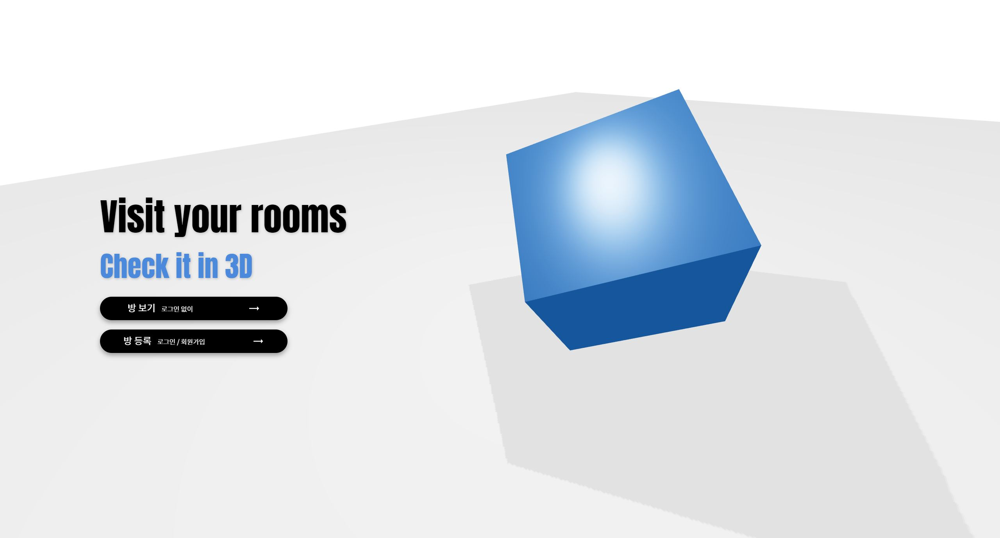
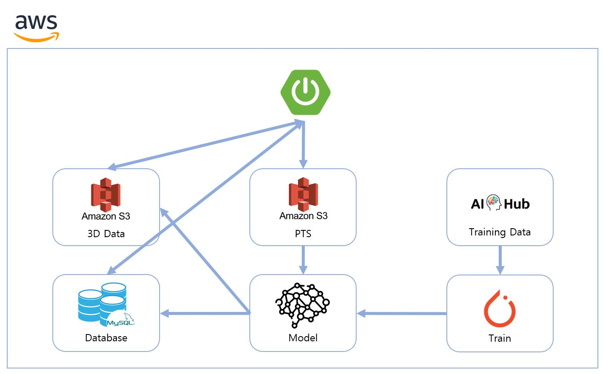
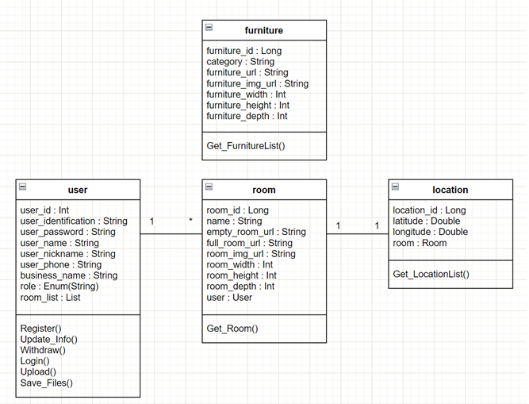
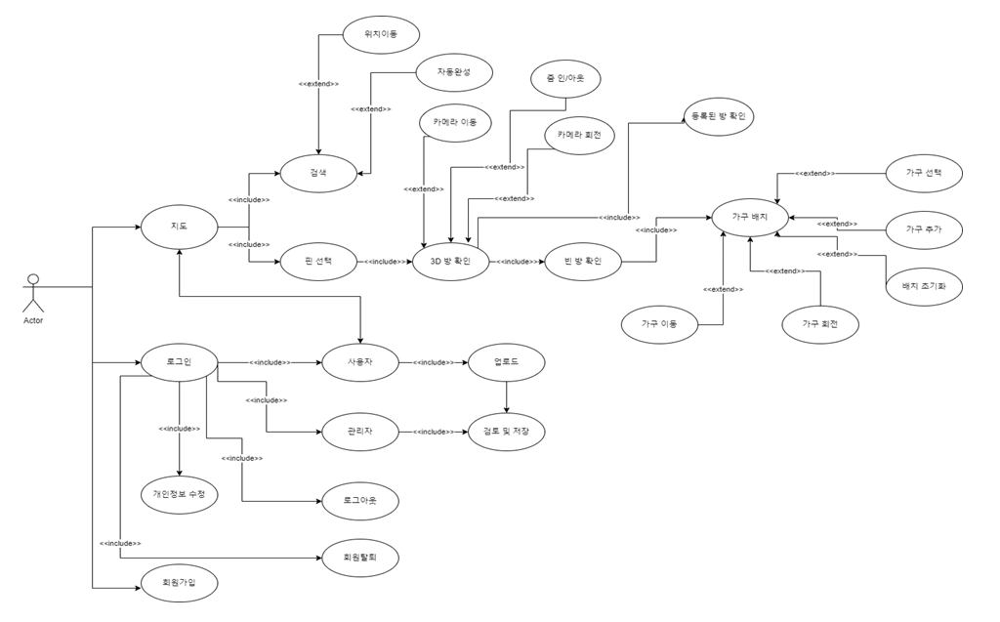

# 실내 공간 3D 종합 데이터를 활용한 가상공간 구축

 

|김동언|김찬규|신우섭| 이기성  |
|:---:|:---:|:---:|:---:|
|- 3D |- 팀장   - Front-end|- Back-end|- AI |

---

# 🔨 Stacks 

#### Back-end

  

 

#### Front-end

  

 

#### AI, Modeling

 

#### Tools

 

---

# 💎 목적  

   
 내용 보기 (👈 Click) 

 

1. 시공간 제약없이 웹 페이지를 통해 실내 공간을 3D로 확인해 사진과 시공간의 한계를 극복

2. 가구의 배치를 가능하게 하여 입주 전 인테리어 구상에 도움

 

---

# 🎤 요구사항  

   
 내용 보기 (👈 Click) 

 

|   요구사항   |            요구사항 설명            |
|:--------:|:-----------------------------:|
|   회원가입   |     업로드를 위해서는 회원가입을 해야 한다     |
| 회원정보 조회  |  회원가입 한 유저는 자신의 정보를 조회할 수 있다  |
| 회원정보 수정  |  회원가입 한 유저는 자신의 정보를 수정할 수 있다  |
|   회원탈퇴   |    회원가입 한 유저는 회원탈퇴를 할 수 있다    |
|   로그인    |    방을 업로드 하기 위해 로그인을 해야 한다    |
|   로그아웃   |    로그인 상태에서 로그아웃 할 수 있다    |
|  파일 업로드  |    사용자가 새로운 3D 파일을 업로드 할 수 있다    |
| 검토 파일 저장 |    관리자는 업로드 된 파일을 검토하고 변환해 DB에 저장할 수 있다    |
|  빈 방 확인  |    사용자가 기존의 방에서 가구를 모두 제외시킨 빈 방의 구조를 확인할 수 있다    |
|    검색    |    지도에서 원하는 지역 근처의 방을 탐색할 수 있다    |
| 등록된 방 확인 |    사용자가 모든 가구가 배치되어 있는 기존의 방을 3D로 확인할 수 있다    |
|  가구 배치   |    사용자는 가구를 배치해 볼 수 있다    |

 

---

# 🛠 아키텍처  

   
 내용 보기 (👈 Click) 

 

 

- Spring Boot 2.7.3
- AWS EC2 / S3
    - 3D 데이터는 JSON 형식의 파일이며 용량이 커 S3 스토리지에 저장
    - DB에는 S3의 객체 접근 URL을 저장하는 방식 채택
- MySQL + Redis

 

---

# 🔍 클래스 다이어그램  

   
 내용 보기 (👈 Click) 

 

 

- 관계 정보

|    이름    |   유형   | 관련 클래스 |   연관 관계   |             설명             |
|:--------:|:------:|:------:|:---------:|:--------------------------:|
| Location | 단방향 연관 |  Room  | 1:1 연관 관계 | 한 개의 방은 한 개의 위치 정보만 가질 수 있다 |
|   User   | 양방향 연관 |  Room  | 1:N 연관 관계 | 유저는 여러 개의 방 정보를 가질 수 있다 |

 

---

# ⚒️ 주요 기능  

   
 내용 보기 (👈 Click) 

 

 

- 지도
    - 지도 내 검색을 통해 원하는 지역의 방을 찾아볼 수 있음
    - 등록된 방을 핀으로 지도에 표시
    - 핀 선택시 3D로 방을 확인할 수 있음
    - 기존의 방 보기 / 방의 구조만 보기 중 선택
        - 가구를 배치해 볼 수 있어 사전 인테리어 구상에 도움
        - 가구의 배치 초기화 기능 제공
- 회원가입
    - 방 등록을 원한다면 회원가입 필요
    - 요구되는 정보 : 아이디, 패스워드, 이름, 닉네임, 휴대폰 번호, 상호명
- 로그인
    - 개인정보 수정 기능 제공
    - .PTS 형식의 파일 업로드 기능 제공
    - 회원탈퇴시 등록한 방 정보 모두 삭제

 

---

# 📋 API 문서  

   
 내용 보기 (👈 Click) 

 

[API 문서](https://wooseobee.gitbook.io/capstone3d-api-docs/)

 

---

### [User Api]
------------------

1. 회원가입
2. 로그인
3. 토큰 재발급
4. 회원정보수정
5. 회원탈퇴

### [Room Api]
------------------

1. 모든 방 조회
2. 선택한 방 조회
3. 모든 가구 조회

### [Upload Api]
------------------

1. 유저 방 업로드
2. 관리자 방 업로드
